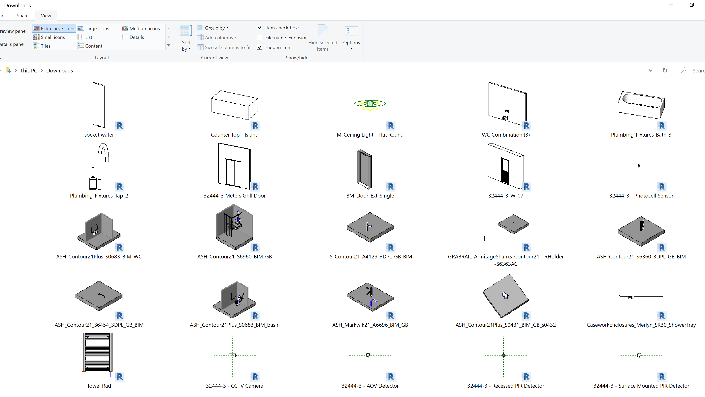

# GetElementImage

Revit C# .NET add-in that exports a PNG image of a selected BIM element with a specified rotation angle.

## Task

The goal is to export "images" of all of the family instances from a Revit model.

When we receive a new Revit model from a new project, and we want to quickly "categorize" all the family symbols there and understand what needs to be tracked and in which way.

Currently, we export all the family symbols to RFA files and look at those:

Problems:

- We don't want to use the RFA format, but some normal imaging format so it can be viewed in some more friendly system, e.g., export these images to jpg or png format.
- We want to be able to export a specific element instance, both `FamilyInstance` and other element types.
- We want to be able to see the element from multiple angles.  

Another option would be to use some Python code (unrelated to Revit, on a computer where Revit is not installed) and just parse these RFA files.

Some possible way to go with this:

For instance, on one extreme, going away from Windows and the Revit desktop API completely, you could push the RVT model to Forge and isolate the individual family instances there, in the cloud, in the Forge viewer. Two of the advantages with that would be: A. everybody can see them, with zero installation requirements, directly in the browser. B. they can be rotated and zoomed directly in the browser, so you can view them from all angles interactively.

Within Revit, on Windows, with the .NET desktop API, a schedule similar to the one in your image can easily be generated.

Simply create a 3D view, isolate the family instance you wish to create a view of, rotate it into the required position and export a screen snapshot or an image file for it. If required, repeat for other viewing angles. Iterate over all the instances one by one to create all the required views. Put all the exported images together into the schedule as required. Disadvantage: fixed viewing angle.

If you have the gltf exporter up and running and doing what you need, you can also use that directly to generate all the gltf 3D data for all the instances and then render them as needed outside of Revit. In theory, here you could actually put real 3D gltf directly into the schedule and rotate each individual family instance inside its own cell.

We will explore option number 2, exporting the images directly from Revit. 

- This gives enough information.
- Simpler to implement.
- It will be merged into another system, that not necessarily will be web-based.

Implementation:

- Pick an element
- Take a picture of it from multiple angles (sides, top, ...)
- Save to PNG file
- Include ability to select other, non-family-instances, elements as well (pipes, ...)
- Use the object dimension to select the distance from the element (currently, just taking its bounding box is enough)

A similar pre-existing implementation was described by Alexander Ignatovich and The Building Coder in the article 
on [exporting image and setting a default 3D view orientation](https://thebuildingcoder.typepad.com/blog/2013/08/setting-a-default-3d-view-orientation.html).

## Author

Jeremy Tammik, [The Building Coder](http://thebuildingcoder.typepad.com), [ADN](http://www.autodesk.com/adn) [Open](http://www.autodesk.com/adnopen), [Autodesk Inc.](http://www.autodesk.com)

## License

This sample is licensed under the terms of the [MIT License](http://opensource.org/licenses/MIT).
Please see the [LICENSE](LICENSE) file for full details.

